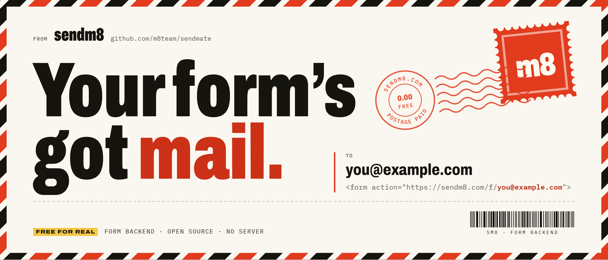
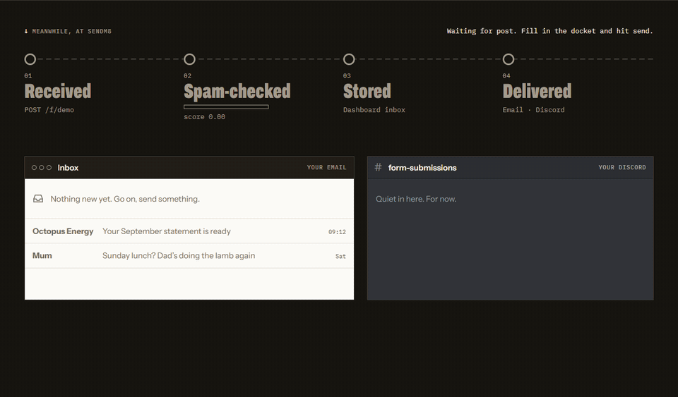
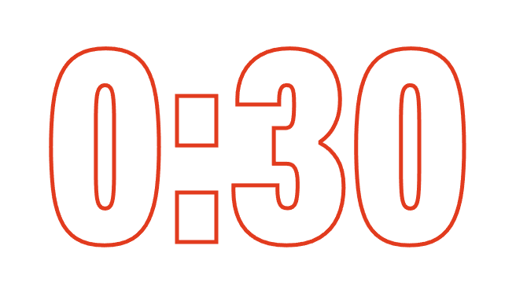
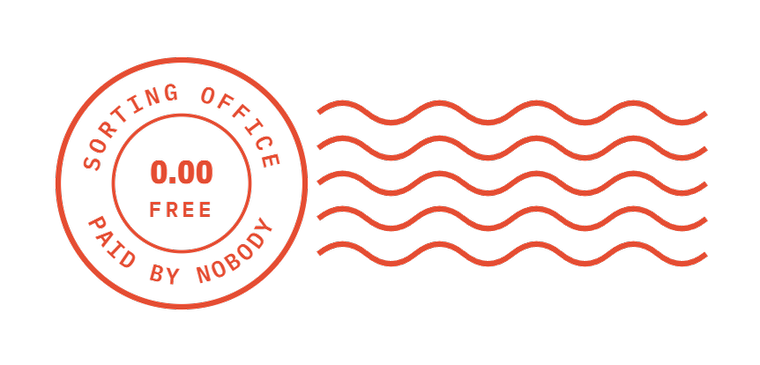
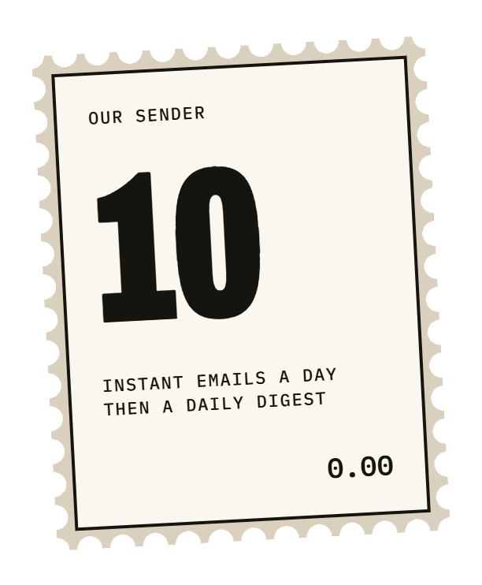
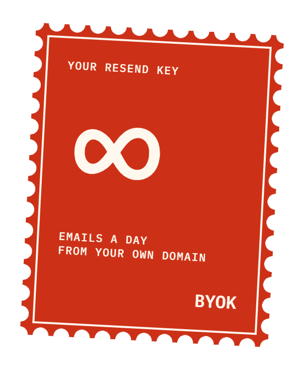
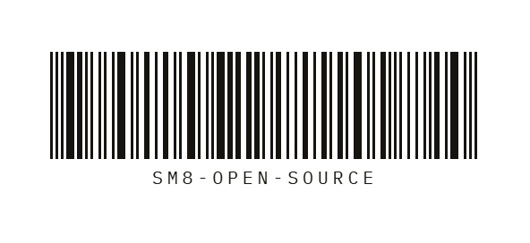
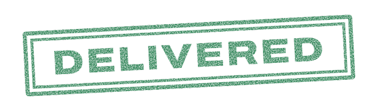

<a href="https://sendm8.com">
  <picture>
    <source media="(prefers-color-scheme: dark)" srcset=".github/assets/banner-dark.png">
    
  </picture>
</a>

<p align="center">
  <b>The free, open-source form backend.</b><br>
  Point any HTML form at sendm8 and the submissions land in your inbox, Discord, Slack or wherever you like.<br>
  No server to run, no signup to start, no catch.
</p>

<p align="center">
  <a href="https://sendm8.com"><b>sendm8.com</b></a>
  &nbsp;·&nbsp;
  <a href="https://sendm8.com/docs">Docs</a>
  &nbsp;·&nbsp;
  <a href="https://sendm8.com/pricing">Pricing (it’s free)</a>
  &nbsp;·&nbsp;
  <a href="docs/self-hosting.md">Self-host</a>
</p>

<p align="center">
  <a href="LICENSE"></a>
  
  
</p>

<p align="center">
  
</p>

<p align="center"></p>

## The 30-second setup

<picture>
  <source media="(prefers-color-scheme: dark)" srcset=".github/assets/clock-dark.png">
  
</picture>

**Paste one URL. That’s the setup.**

```html
<form action="https://sendm8.com/f/you@example.com" method="POST">
  <input name="email" type="email" required>
  <textarea name="message"></textarea>
  <input type="text" name="_gotcha" style="display:none">
  <button>Send</button>
</form>
```

1. **Point your form at sendm8.** Set the `action` to `sendm8.com/f/` plus your email. Keep your own HTML, styling and fields.
2. **Send a test.** Fill it in yourself. We email you once to check the address is really yours.
3. **Click confirm. Done.** That first submission is delivered, and so is every one after it. Sign in later for a private form ID, the dashboard inbox and more.

> [!TIP]
> **Moving from Formspree?** Change the `action` URL. `_replyto`, `_subject`, `_next`, `_gotcha` and `_cc` work the same. The [migration guide](https://sendm8.com/docs#formspree) covers `fetch`, React and AI-assisted migrations.
>
> **Using an AI assistant?** Point it at [sendm8.com/llms.txt](https://sendm8.com/llms.txt), the docs as Markdown.
>
> **Want JSON back instead of a redirect?** Send `Accept: application/json`. See the [AJAX guide](https://sendm8.com/docs#ajax).

## What’s in the box

<picture>
  <source media="(prefers-color-scheme: dark)" srcset=".github/assets/postmark-dark.png">
  
</picture>

**Everything’s included. Declared value: nothing.**<br>
No feature grid, no locked padlock icons. Here’s the full manifest, the same for everyone.

| No. | Contents | Qty / limit | Value |
|:---|:---|:---|---:|
| 001 | **Forms and a dashboard inbox.** Search, star, filter, bulk-tidy, and a spam folder to double-check. | 100 forms<br>1,000 / form / month | 0.00 |
| 002 | **Email notifications.** Instant up to the daily cap, then one tidy digest instead of forty pings. | 10 instant / day<br>∞ with your own key | 0.00 |
| 003 | **Discord, Slack, Telegram and signed webhooks.** Automatic retries and a “send test” button on every channel. | ∞ | 0.00 |
| 004 | **Spam and abuse protection.** Five layers, a phishing guard, a public report page. | 5 layers | 0.00 |
| 005 | **File uploads** to R2, with hard storage caps. | 5 MB / file | 0.00 |
| 006 | **CSV and JSON export.** It’s your data. There’s no fee to get it back. | ∞ | 0.00 |
| 007 | **Zero-signup endpoints** you can claim later. | 100 / month until claimed | 0.00 |
| 008 | **The source code.** All of it, self-hostable in one click. | AGPL-3.0 | 0.00 |
| | | **Total** | **0.00** |

## Postage

**Use our stamps, or bring your own.** Our sender is free with zero setup: hit the daily cap and the rest arrive in tonight’s digest, so nothing is dropped. Or plug in your [Resend](https://resend.com) key and go unlimited, from your own domain. The key is encrypted at rest and never shown in full again. [Connect Resend in 2 minutes](https://sendm8.com/docs#byok).

<p align="center">
  <picture>
    <source media="(prefers-color-scheme: dark)" srcset=".github/assets/pstamp-ours-dark.png">
    
  </picture>
  &nbsp;&nbsp;&nbsp;
  <picture>
    <source media="(prefers-color-scheme: dark)" srcset=".github/assets/pstamp-yours-dark.png">
    
  </picture>
</p>

## Sorting office rules

<picture>
  <source media="(prefers-color-scheme: dark)" srcset=".github/assets/stamp-return-dark.png">
  
</picture>

**Spam gets returned to sender.** Five layers, cheapest first. Most bots fall at the first one.

1. **Honeypot.** A hidden field only bots fill in. Costs your real visitors nothing.
2. **Rate limits and blocklists.** 10 a minute per visitor, per form. Repeat offenders are blocked by hashed IP, never stored raw.
3. **Heuristics.** Link-stuffing, known spam phrases, throwaway email domains, keyboard-mash gibberish.
4. **Turnstile challenge.** Borderline? The visitor gets a quick Cloudflare Turnstile check. No puzzles about traffic lights.
5. **AI score.** Optional. Runs after the submission is stored, so it never slows anyone down.

Spam isn’t deleted straight away. It waits in your spam folder for 30 days, and one click on “Not spam” delivers it as normal.

> [!IMPORTANT]
> **Phishing guard.** Forms that ask for passwords, card numbers or seed phrases are held for review, not delivered. Free form backends get used for phishing. Not this one.

## Run your own post office

<picture>
  <source media="(prefers-color-scheme: dark)" srcset=".github/assets/barcode-dark.png">
  
</picture>

sendm8 is open source, all of it. The code on sendm8.com is the code on GitHub. There’s no “enterprise edition” hiding the good bits.

- One Worker and one D1 database
- Fits Cloudflare’s free plan, with usage alerts and load shedding built in
- Your limits, in one config file

[](https://deploy.workers.cloudflare.com/?url=https://github.com/m8team/sendmate)

The full walkthrough is in [docs/self-hosting.md](docs/self-hosting.md), and the webhook format is in [docs/webhooks.md](docs/webhooks.md). If we ever vanish, your forms don’t have to.

## How we stack up

<picture>
  <source media="(prefers-color-scheme: dark)" srcset=".github/assets/stamp-trash-dark.png">
  
</picture>

Free plans only, taken from each service’s own pricing page and docs. Checked 15 Sep 2026, with sources at [sendm8.com/#compare](https://sendm8.com/#compare). Plans change, so if something’s out of date, [tell us](https://github.com/m8team/sendmate/issues) and we’ll fix it.

| Free plan | **sendm8** | Formspree | Web3Forms | FormSubmit |
|---|---|---|---|---|
| Free submissions / month | **1,000 per form** | 50 | 250 | Unlimited |
| Forms | **Up to 100** | Unlimited | Unlimited | Unlimited |
| Works without signing up | **Yes, email in the URL** | No, account needed | Verify your email for a key | Yes, email in the URL |
| Stored submissions + export | **Dashboard, CSV + JSON** | 30-day archive, export on paid plans | 30-day history, CSV | 30 days, API only |
| Webhooks + chat apps | **Webhooks, Discord, Slack, Telegram** | Discord, Slack, Telegram | Paid plans | Webhooks |
| File uploads | **5 MB a file** | Paid plans | Paid plans | Yes |
| Custom redirect | **Yes** | Paid plans | Yes | Yes |
| Open source, self-hostable | **Yes, AGPL-3.0** | No | Not listed | Not listed |
| Cheapest paid plan | **There isn’t one** | $15/mo | $16/mo, billed yearly | None listed |

**Fair’s fair.** FormSubmit needs no account at all. Formspree runs a machine-learning spam filter on every plan, and free forms can post to Discord, Slack and Telegram. Web3Forms gives the most free submissions of the capped services, with CSV export included.

## Behind the counter

| Path | What |
|---|---|
| `worker/` | Cloudflare Worker: submission endpoint, delivery, dashboard API, auth, cron jobs |
| `web/` | Astro + Vue site and dashboard, served by the Worker as static assets |
| `wrangler.jsonc` | Worker config (at the root so "Deploy to Cloudflare" works) |
| `packages/shared/` | Limits and API types shared by both |
| `docs/` | [Self-hosting](docs/self-hosting.md), [webhooks](docs/webhooks.md) |

```sh
npm install
cp .dev.vars.example .dev.vars   # fill in secrets, uncomment the local-only lines
npm run db:migrate:local -w worker
npm run dev                       # http://localhost:8787 (Dev sign-in on the sign-in page)
npm test                          # worker + web tests
npm run test:coverage             # fails below 70% coverage
```

## Licence

[AGPL-3.0](LICENSE). Built by the sendm8 contributors.

<p align="center"></p>

<p align="center">
  <picture>
    <source media="(prefers-color-scheme: dark)" srcset=".github/assets/stamp-delivered-dark.png">
    
  </picture>
</p>

<h3 align="center">Got a form? Send it, mate.</h3>
<p align="center"><code>https://sendm8.com/f/you@example.com</code></p>
